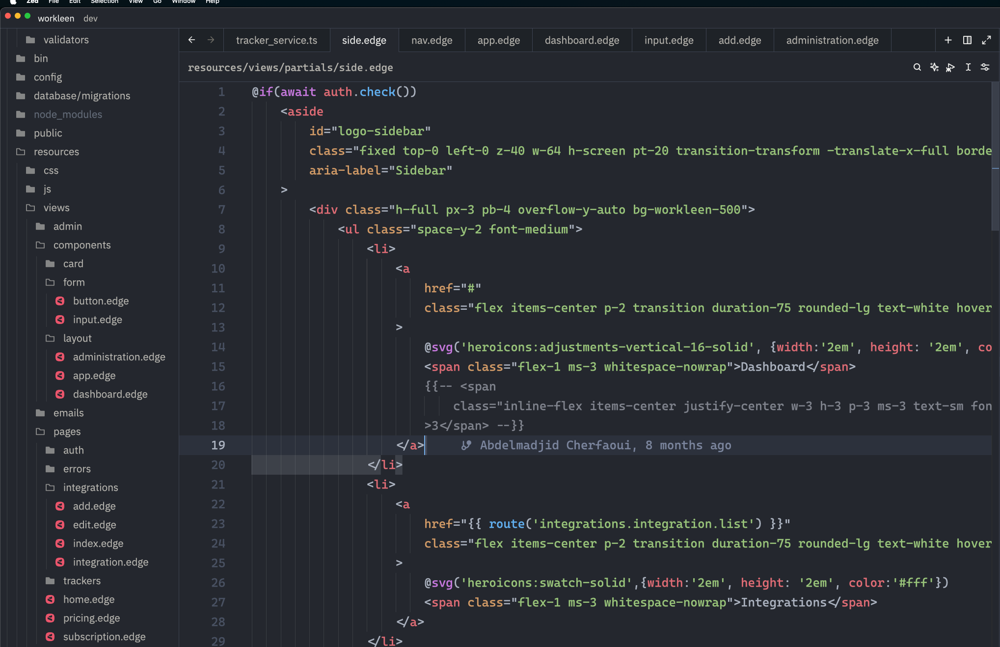

# About Zed-Edge

Zed Edge is an extension that add the feature of syntax highlighting to Zed.

## NOTE
Because of Zed is currently has a limited ecosystem compared to VSCode, the available themes are not covering all possible situations.
For better results,use One Dark Pro theme which has a very good coverage for different languages.

~~The extension is still in **development mode** and not ready yet for production.~~
~~I'm progressively developing it and trying to making it more mature.~~

The extension now is ready to be used in production. It covers all the possible situation in EdgeJS.

If you face any issue please report it by opening an issue.

