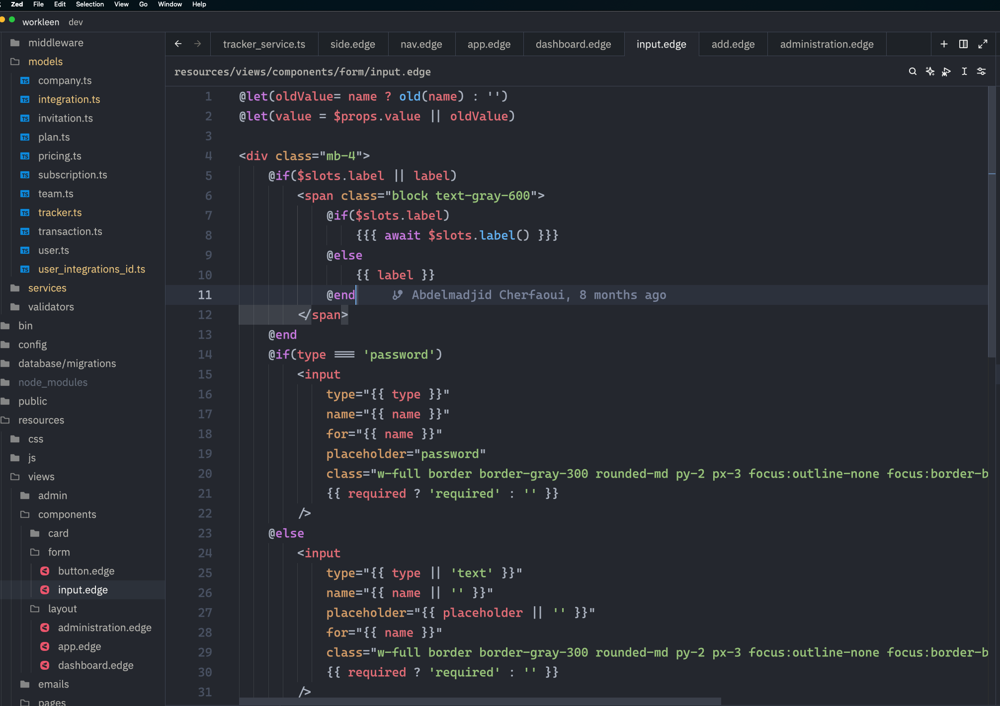

# Zed Edge Extension

A comprehensive Zed extension that provides syntax highlighting and language server support for EdgeJS templates.

## Features

- **Syntax Highlighting**: Full syntax highlighting support for EdgeJS templates using tree-sitter
- **Language Server**: Automatic installation and integration of the Edge language server
- **HTML Support**: Full HTML syntax highlighting and language server features
- **Emmet Support**: Emmet abbreviations and expansion for faster HTML development
- **Auto-completion**: Intelligent code completion for EdgeJS directives and expressions
- **Error Detection**: Real-time error detection and diagnostics
- **Hover Information**: Rich hover information for EdgeJS syntax
- **Format on Save**: Automatically formats EdgeJS templates on save

## Installation

1. Open Zed
2. Go to Extensions (Cmd+Shift+X)
3. Search for "Edge"
4. Click Install

## Requirements

- Zed editor (version 0.100.0 or later)
- Node.js (automatically used by the extension for language server functionality)

## Language Server

The extension automatically installs and manages the `edge-language-server` NPM package. No manual setup is required!

## Usage

Once installed, the extension will automatically:

1. Provide syntax highlighting for `.edge` files
2. Download and configure the language server on first use
3. Offer intelligent code completion and error detection

## Configuration

You can configure the language server version in your Zed settings:

```json
{
  "lsp": {
    "edge-language-server": {
      "initialization_options": {
        "edge_language_server_version": "latest"
      }
    }
  }
}
```

## Supported Features

- EdgeJS directives (@if, @each, @include, etc.)
- Template expressions ({{ }}, {{{ }}})
- Full HTML language features and syntax highlighting
- Emmet abbreviations and expansion
- CSS and JavaScript embedded content
- Comments and documentation
- Format on save

## Issues and Contributing

If you encounter any issues or have suggestions for improvements, please open an issue on the [GitHub repository](https://github.com/Hexacker/zed-edge).

### Known Issues

- EdgeJS directives may not work as expected in certain scenarios




